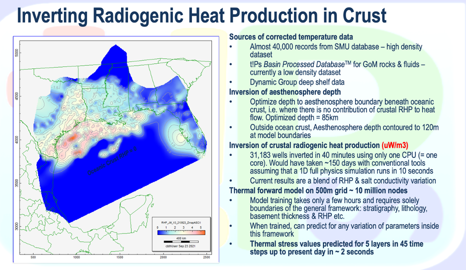

# Interactive Regional GOM Model

This daisi is the deployment of the code of the paper
**Outcrop to Basin center thermal evolution of the US Gulf of Mexico Basin**,
Andrew Pepper, Nawaz Bugti, Lara Heister, Julie O’Leary, Jean-Marie Laigle, Elizabeth Roller, Jack Stalnaker, Paul Mann and Rob Pascoe.  
Presented at the conference AAPG - SEG IMAGE, Denver, 29th September 2021.

The model can be accessed:

- interactively with the accompanying app
- programmatically since it is deployed as a daisi

## Background

### Regional geological model

We have defined 5 key sequence and map their boundaries regionally across the Gulf Coast :

1. Plio - Pelistocene
2. Miocene
3. Paleogene
4. Late Cretaceous
5. Mid Jurassic to Mid Cretaceous

At this scale, the lithological model remains basic, with two components, sand and shale.

A full crustal model has been defined with three layers, upper crust, lower crust and
upper mantle.The thickness of these layers vary regionally, as well as the
Radiogenic Heat Production in the upper and lower crust layers.



### Machine Learning to compute instantly Temperature and Standard Thermal Stress

A ML model has been trained following the methodology developed by Laigle et al. 2018.
The trained model is capable of almost instant inference at any location with an accuracy of 99.9%
compare to output of a full physics basin simulator. This enables the rapid exploration
of parameters range.

The ML model has been used as a forward simulator to invert the mantle thickness and the
Radiogenic Heat Production in the crust at about 35,000 wells locations across the Gulf Coast.
Thanks to the rapid inference, the overall inversion runs in about 40mins on one single CPU.

## Using the ML model

You can leverage the deployed daisi for:

- Running predictions with your own geological model, 1D, 2D or 3D
- Retrieve predictions from the Pepper et al. model

### Predicting with your own geological model in Python

You will access the `predict` endpoint with the `pydaisi` package

1. First access the `GOM App` daisi:

    ```python
    import pydaisi as pyd

    gom_model = pyd.Daisi("GOM App")
    ```

2. Structure your data  

    Input data are expected in the form of a Numpy array with shape (16,nx,ny).
    It can be seen as a stack of 16 grids containing the following info:

    - Grids 0 to 5 contain the depth of the 6 key horizons, from topography to top basement. Depth are in mTVDSS, increasing downwards
    - Grids 6 to 10 contain the sand/shale ratio map for the 5 layers, between 0 and 1
    - Grid 11 : Total Crust thickness (m)
    - Grid 12 : Upper Crust RHP ()
    - Grid 13 : Upper Mantle thickness (m)
    - Grid 14 : Lower Crust RHP
    - Grid 15 : present day surface temperature

3. Get predictions

```python
result = gom_model.predict(your_data).value
```
